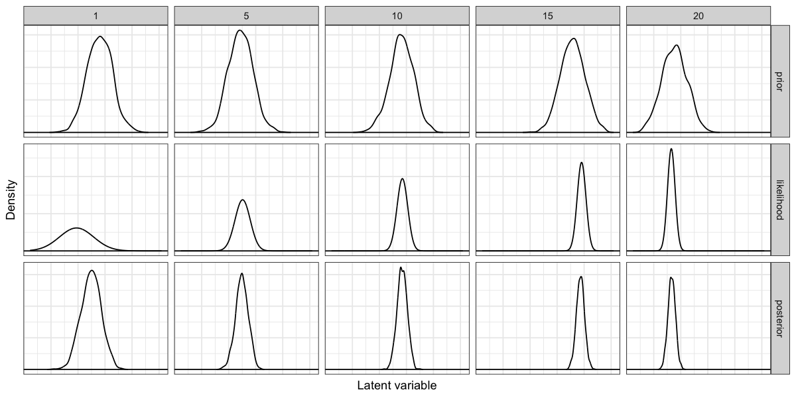

<!-- README.md is generated from README.Rmd. Please edit that file -->

```{r, include = FALSE}
knitr::opts_chunk$set(
  collapse = TRUE,
  comment = "#>"
)
```

# Latent variable models 

<!-- badges: start -->
<!-- badges: end -->

A brief exploration of a simple multilevel regression model as in Gelman, Hill (2007). All details can be found in the [Jupyter notebook](multi_level_reg_feedback.ipynb). You may have to reload once since the HTML included in the file does not always render on first try. A brief overview is provided below.

## Overview

We use the EM algorithm the uncover the latent factors and fit the multilevel regression model. To do so we first derive the *expected* complete data log-likelihood (CLL):

$$
Q(\theta, \theta_{t-1}) = \mathbb{E}_{p(\mathbf{z}|\mathbf{y}, \mathbf{X}, \theta_{t-1})} \left[ \log \ell (\theta | \mathbf{y}, \mathbf{X}, \mathbf{z}) \right]
$$

Using numerical exercises for synthetic data we show how the algorithm behaves as we play with noise parameters and sample size. We also include a short section on Bayesian inference on the latent variable. As expected our latent variables estimates are closer to their "true", simulated values when uncertainty around the "true" value is low. Conversely, the poster density of $\mathbf{z}$ will generally be closer in shape to the likelihood of the data, if the data is precise (i.e. group-level samples are large).




